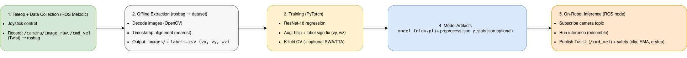
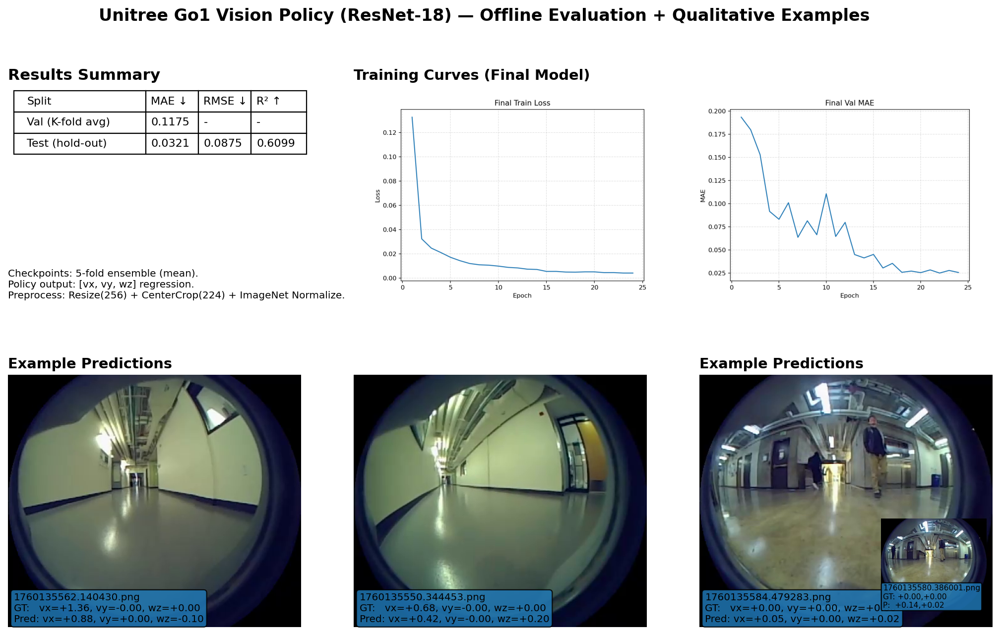

## Unitree Go1: Learning Robotics Through Vision + Deep Learning

**ROS Melodic · PyTorch · ResNet-18 · Real-World Deployment**

I built this project to deepen my understanding of robotics by applying deep learning in a real, embodied system. Rather than working purely in simulation, I focused on designing and implementing an end-to-end pipeline—from teleoperation and data collection to model training and on-robot deployment—using a Unitree Go1 quadruped.

The core goal of this project was not just to train a vision model, but to understand how data, models, and systems interact when machine learning is deployed on physical hardware.

---

## 1. Motivation

I started this Go1 project with two primary goals:

1. **Learn robotics through a full end-to-end system**, rather than isolated scripts or simulation-only experiments
2. **Apply machine learning to a physical robot** and understand real-world constraints such as data quality, latency, and deployment complexity

This project is intentionally *systems-first*. I wanted hands-on experience with the complete pipeline—from raw sensor data to a trained model running on a real robot.

---

## 2. System Overview

### Hardware

* Unitree Go1 quadruped robot (onboard camera)

### Software

* ROS Melodic
* Python + PyTorch (training and inference)
* OpenCV (image processing, dataset extraction, debugging)
* Joystick / teleoperation for data collection

### High-Level Pipeline

1. Teleoperate the robot and record ROS bags
2. Extract camera frames and action labels from rosbag files
3. Train a vision-based model using ResNet-18
4. Deploy the trained model back onto the Go1 and run inference on-robot

---

## 3. Data Collection (Teleoperation + rosbag)

I collected real-world training data by manually controlling the Go1 via joystick teleoperation while recording relevant ROS topics using rosbag.

### Why teleoperation + rosbag?

* Fast and practical way to gather realistic robot data
* Captures real environment conditions, sensor noise, and motion blur
* Enables iterative improvement: record → inspect → recollect

### Data Recorded

* Camera image stream (primary learning signal)
* Motion commands (used as supervision targets for learning)

---

## 4. Dataset Construction (rosbag → images)

After recording, I processed rosbag files offline to construct a training-ready dataset.

### Key Steps

* Parse ROS image topics from rosbag files
* Convert ROS image messages into standard image arrays
* Save frames to disk and align them with corresponding control commands
* Validate data quality (resolution, blur, lighting consistency)

### Why OpenCV?

* Reliable conversion from ROS image formats
* Fast visualization for spotting corrupted or misaligned frames
* Standard preprocessing utilities compatible with ML pipelines

This step transformed raw ROS logs into a clean supervised learning dataset.

---

## 5. Model Training (ResNet-18, PyTorch)

I trained a vision model using **ResNet-18** as the backbone to map camera images to motion commands.

### Why ResNet-18?

* Strong and well-understood baseline for vision tasks
* Computationally efficient, making it suitable for real-time or near-real-time inference
* Easy to debug and iterate during experimentation

### Training Results

* Achieved strong validation performance
* The model generalized well enough to be tested directly on the robot

---

## 6. On-Robot Deployment & Inference

A major milestone of this project was deploying the trained model back onto the Go1 and running inference successfully on the robot.

### What Worked

* The model ran reliably on the robot and produced stable predictions
* The full pipeline—sensor input → model inference → output—worked end to end

### Why This Matters

Training a model is only half the problem. Deployment on a real robot introduces additional challenges, including:

* Limited compute resources
* Dependency and environment management
* Real-time behavior requirements
* Robustness to changing lighting and environments

Successfully running inference on the Go1 validated the practicality of the entire system.

---

## 7. Lessons Learned

* Robotics projects require **systems thinking**: data pipelines and deployment matter as much as model architecture
* Real-world data quality (lighting, motion blur, camera angle) strongly impacts performance
* Simple, well-chosen baselines like ResNet-18 can be highly effective when the overall pipeline is solid

---

## 8. Future Work

* Improve generalization across environments (indoors vs. outdoors, lighting changes)
* Incorporate richer supervision or self-supervised learning methods
* Explore more advanced policies (e.g., diffusion policies or VLA-style approaches)
* Extend from perception-only models to tighter perception-control loops

---

## Links

* **Code & assets:** [https://yuni-wyx.github.io/go1-autonomous-navigation](https://yuni-wyx.github.io/go1-autonomous-navigation)